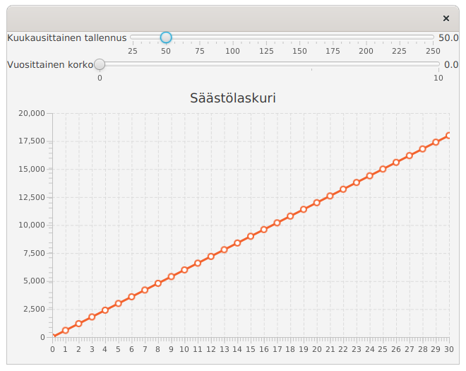
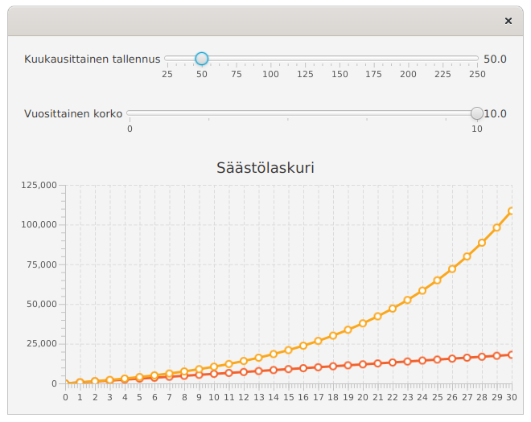

# Tehtävä: 03.Saastolaskuri (3 osaa)

Toteutetaan tässä tehtävässä sovellus, jota käytetään säästämiseen 
liittyvien mahdollisten tuottojen tarkasteluun. Laskuri tarjoaa 
mahdollisuuden sekä kuukausittaisen säästön määrittelyyn että vuosittaisen 
koron määrittelyyn, ja näyttää säästösumman kasvun kolmenkymmenen vuoden 
aikana yli.

## Osa 1: Käyttöliittymä

Toteuta ensin sovelluksen käyttöliittymä. Sovelluksen komponentteja 
hallinnoidaan BorderPanen avulla. BorderPanen keskellä on viivakaavio 
(LineChart), joka sisältää kaksi numeerista akselia (NumberAxis). 
BorderPanen ylälaidassa on VBox-asettelu. VBox-asettelu sisältää kaksi 
BorderPanea. Ensimmäisessä (ylemmässä) BorderPanessa on vasemmalla 
teksti "Kuukausittainen tallennus", keskellä liukuri (Slider), ja oikealla 
liukurin arvoa kuvaava teksti. Toisessa (alemmassa) BorderPanessa on 
vasemmalla teksti "Vuosittainen", keskellä liukuri (Slider), ja oikealla 
liukurin arvoa kuvaava teksti.

Löydät vinkkejä Slider-luokan käyttöön hakemalla Googlesta 
avainsanoilla "javafx slider".

Määrittele Sliderit siten, että kuukausittaista tallennusta kuvaavan 
Sliderin minimiarvo on 25 ja maksimiarvo on 250. Vuosittaisen koron 
minimiarvo on 0 ja maksimiarvo on 10. Kaavion x-akselin tulee näyttää 
arvon nollasta kolmeenkymmeneen, jotka kuvaavat vuosien kehitystä. 
Y-akselin arvojen tulee mukautua näytettäviin arvoihin.

Sovellus näyttää tämän vaiheen jälkeen seuraavalta.

## Osa 2: Tallennusten näyttäminen

Kun käyttöliittymän rakenne ja ulkoasu on kohdallaan, aloitetaan laskurin 
toiminnallisuuden toteuttaminen.

Muokkaa käyttöliittymää siten, että kun käyttäjä siirtää kuukausittaiseen 
tallennukseen liittyvää liukuria (ylempi liukureista), kaavion näyttämä 
tallennuksen kasvua vuosien yli kuvaava kaavio päivittyy ja näyttää 
tallennuksen kasvun. Esimerkiksi kun kuukausittainen tallennus on 50, 
tulee kaaviossa olla viiva, joka näyttää 
arvot [(0, 0), (1, 600), (2, 1200), (3, 1800), ...]

Sovellus näyttää tämän vaiheen jälkeen (esimerkiksi) seuraavalta. Alla i
kuukausittaisen tallennuksen arvoksi on valittu 50.

## Osa 3: Tallennusten näyttäminen korkoineen

Muokkaa käyttöliittymää siten, että koron näyttäminen sovelluksessa toimii. 
Tämän jälkeen sovelluksen tulee näyttää kaksi viivaa, yksi viivoista näyttää 
pelkän talletuksen, ja toinen viiva näyttää talletuksen korkoineen.

Laske korko vuosittain vuoden lopussa olevan tallennuksen perusteella 
(eli hieman optimistisesti). Esimerkiksi kun kuukausittainen tallennus 
on 50 ja vuosikorko 5%, tulee vuosittaisten summien 
korkoineen olla [(0, 0), (1, 630), (2, 1291.5), (3, 1986.075), ...]

Sovellus näyttää tämän vaiheen jälkeen (esimerkiksi) seuraavalta. 
Alla kuukausittaisen tallennuksen arvoksi on valittu 50 ja koroksi 
10 (eli 10% korko).

