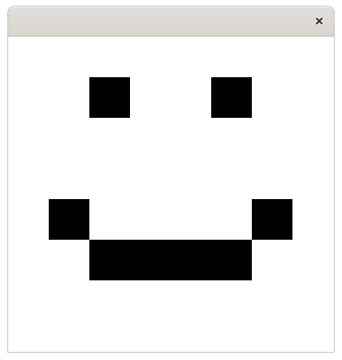

# Tehtävä: 06.Hymio

Luo tehtäväpohjassa olevaan luokkaan graafinen käyttöliittymä. Lisää 
graafiseen käyttöliittymään asettelusta vastaava BorderPane-olio. Lisää 
BorderPanen keskellä Canvas-olio. Piirrä tämän jälkeen Canvas-olioon 
liittyvän GraphicsContext-olion avulla hymiö. Käytä taustan värinä i
valkoista (Color.WHITE) ja hymiön värinä mustaa (Color.BLACK).

Tehtävän testit tarkastavat vain, että piirrät ikkunaan. Palauta tehtävä 
vasta kun saat hymiön piirtämisen toimimaan. Huomaa ettei tässä ole 
tarkoitus piirtää hymiötä esimerkiksi hiirellä — käytä suoraan 
GraphicsContext-olion tarjoamia metodeja siten että kuva on piirrettynä 
heti ohjelman käynnistyessä.

