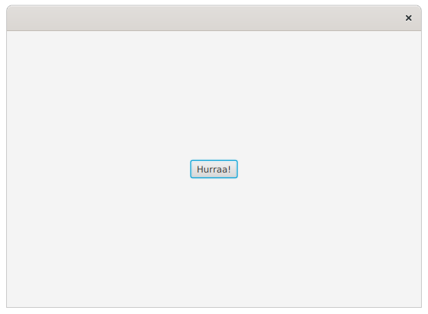

# Tehtävä_: 08.Hurraa

Tehtäväpohjan juurikansiossa on tiedosto `Applause-Yannick_Lemieux.wav`, 
joka sisältää hurrausäänen. Tehtävänäsi on luoda sovellus, 
missä on "Hurraa"-nappi. Kun käyttäjä painaa nappia, sovelluksen tulee 
soittaa edellä mainittu äänitiedosto.

Äänitiedosto on Yannick Lemieuxin nauhoittama. Tiedosto on lisensoitu 
Creative Commonsin Attribuutiolisenssillä [https://creativecommons.org/licenses/by/3.0/](https://creativecommons.org/licenses/by/3.0/).

Huom. Äänitiedosto on rikki, laitettu tilalle 
`front-desk-bells-daniel_simon.wav`

Esimerkissä käytetään Daniel Simionin 
Creative Commons Attribution 3.0-lisenssillä julkaisemaa äänitiedostoa. 
Äänitiedoston voi kuunnella alla. Äänitiedosto on noudettu osoitteessa 
[http://soundbible.com/](http://soundbible.com/) olevasta palvelusta.
